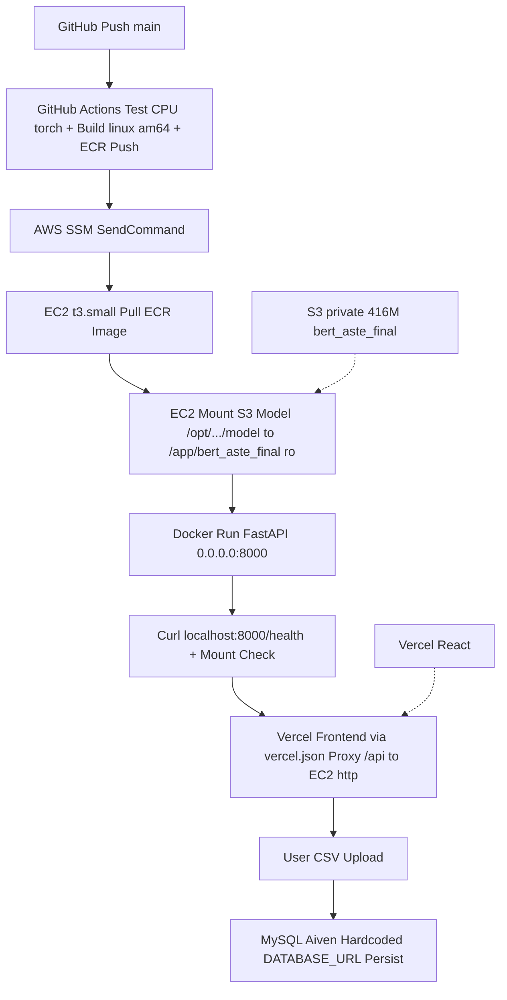

# Cloud.md — Complete AWS Deployment Knowledge | Sequential Long Form | 8th Grade English | Why We Chose What | By The Way | No Push

> **How to read:** Start at Heading 1, go down to 15. Every heading tells **what we did to deploy**, and after every choice there is **By The Way — Why we chose this, why not others**. This is your Cloud + Deployment interview script. Same pattern as `model.md` — headings, direct points, best examples, maximum words, no tables for long explanations.

---

## 1. What Did We Deploy and Where? (The One-Line Answer)

We deployed **`FastAPI + BERT (416M)` backend on `AWS EC2 t3.small` in `ap-south-1` (Mumbai)**, frontend stays on `Vercel`. No local large build, no model in git, no model in Docker image.

- **Frontend:** `React` on `Vercel` `https://customer-feedback-insight-system.vercel.app` — stays.
- **Backend:** `FastAPI` `cfa.api.main:app` on `EC2` `i-010a45ed37176947b` `t3.small` `Amazon Linux 2023` `x86_64` `http://3.109.121.85:8000` — new.
- **Model:** `bert-base-uncased` 5-label `model.safetensors` 415M on `S3` `s3://customer-sentiment-analysis-model-ap-south-1/bert_aste_final/` → EC2 `/opt/customer-sentiment-analysis/model` → mount `-v ...:ro` → `/app/bert_aste_final`.

**Example you must say in interview:**
> "Frontend on Vercel, backend FastAPI+ BERT on EC2 t3.small ap-south-1, model on S3/private, Docker image on ECR, deploy via GitHub Actions → SSM, no SSH 22, no local large ops."

---

## 2. What Flow Did We Do To Deploy? (Sequential, What We Did)

**Read top to bottom — this is your deployment birth story:**

### 2.1 Step 1 — We Chose Architecture (Why This, Not Others) — By The Way

We did:
```
React (Vercel) → EC2 t3.small (Docker → FastAPI → BERT) → /opt/.../model (S3) → ECR → SSM → GitHub Actions
```

**By The Way — Why we chose this?** Project only needs to run ~10 days, low cost, simple, easy delete, no local large ML env. So we chose `Vercel` (free React) + `EC2` (simple long-running API) + `Docker` (repeatable) + `ECR` (private image) + `S3` (416M model) + `SSM` (no SSH) + `GitHub Actions` (auto) + `CloudFormation` (grouped infra).

**Why not others?**
- **Why not `t3.micro`?** `t3.micro` 1GB → `model 415M + torch 800M = 1.2G` → **OOM kill** → container restart loop. We tried, logs `Killed`. So we **upgraded to `t3.small` 2GB** — smallest practical, not large production `m5` (overkill for 10 days).
- **Why not `Lambda`?** Lambda max 250M unzip, 10 sec timeout, our `bert_aste_final` 416M + torch 800M = 1.2G → too big, plus need long-running `FastAPI` (not one Lambda call). So EC2 long-running is simpler.
- **Why not `SageMaker`?** SageMaker is managed ML, great for production, but our model already trained, traffic small, Docker on EC2 is **simpler and cheaper** for 10 days — no extra SageMaker layer needed.
- **Why not `ECS/Kubernetes`?** Overkill — we have 1 container, 1 EC2, no auto-scaling needed for 10-day hackathon. EC2 + Docker is **one command** `docker run`.
- **Why not `Elastic IP`?** EC2 public IP `3.109.121.85` can change after stop/start, but project temporary, minimal. Elastic IP needs extra cost/config, not needed. If IP changes, we update `frontend/src/api.js` `DEPLOYED_API` (now `vercel.json` proxy avoids hardcode).
- **Why not model in `Git`?** 416M in Git → clone slow, CI 416M download every run, couples code+model. So `GitHub = code`, `S3 = model` separation.
- **Why not model in `Docker` image?** Image would be `1.5G` (code 400M + model 416M + torch) → every code change rebuild 1.5G push → slow. Separation → code change 400M push, model update does not need image rebuild.
- **Why `S3` private not public?** Model is private, `Block Public Access ON`, `ACLs disabled`, `SSE-S3` — only EC2 role can read.

### 2.2 Step 2 — We Set Region `ap-south-1` Mumbai — By The Way

We created all major resources in `ap-south-1`.

**By The Way — Why `ap-south-1`?** Closest to India (KIET), low latency for demo, and `aiven MySQL` also in same region. Why not `us-east-1`? Farther, extra latency for `t3.small` → frontend `Vercel` would still work but slower.

### 2.3 Step 3 — We Used IAM, Not Root — By The Way

We enabled **Root MFA**, then created IAM user `customer-sentiment-analysis-admin` for normal work. Root not used for deploy.

**By The Way — Why IAM?** To separate highly privileged `root` from daily `ECR push, SSM` — least privilege, controls permissions.

### 2.4 Step 4 — We Checked Budget $20 — By The Way

Existing budget `Customer Project Cognizant Budgets` $20/month with alerts 80%/100% actual/forecast. No second budget.

**By The Way — Why $20?** 10-day `t3.small` ~$15 + ECR/S3 ~$2 < $20, so inside budget. Why not new budget? Existing already covers.

### 2.5 Step 5 — We Used CloudFormation `customer-sentiment-analysis-backend` — By The Way

Stack `CREATE_COMPLETE` grouped `EC2`, `ECR`, `Security Group`, `EC2 IAM role`, `Instance profile`, `CloudWatch log group`, `EBS 30GB gp3 encrypted`.

**By The Way — Why CloudFormation?** **Infrastructure as code** — repeatable, grouped, easy delete: delete stack → all stack-managed resources deleted. Why not manual console clicks? Manual is error-prone, no grouping, hard cleanup.

### 2.6 Step 6 — We Ran EC2 `t3.small` — By The Way

ID `i-010a45ed37176947b`, name `customer-sentiment-analysis-api`, 2 vCPU 2GB, `Amazon Linux 2023` `x86_64`, 30GB `gp3` encrypted `DeleteOnTermination true`.

**By The Way — Detailed why `t3.small`:** See 2.1. `t3.micro` OOM, `t3.medium` 4GB overkill for 10 days. `2 vCPU` enough for `BERT 150ms per review`, `30GB` enough for Docker + model `416M` + `torch`.

### 2.7 Step 7 — We Did NOT Use SSH — By The Way

No `key-pair`, **no port 22**. Used `AWS Systems Manager Session Manager/Run Command`.

**By The Way — Why SSM not SSH?** With SSH, GitHub needs `private key`, `port 22` open, `public key on EC2`. With SSM: `GitHub Actions → AWS API → SSM → EC2` — no key, no 22, **simpler and more secure** for GitHub → EC2. EC2 role has `AmazonSSMManagedInstanceCore`.

### 2.8 Step 8 — We Opened Security Group `customer-sentiment-analysis-sg` `TCP 8000 0.0.0.0/0` — By The Way

Uvicorn listens `0.0.0.0:8000`, so API reachable `http://<EC2_PUBLIC_IP>:8000`. Port 22 not needed.

**By The Way — Why `0.0.0.0:8000` not `127.0.0.1`?** `127.0.0.1` only inside container, `0.0.0.0` allows **outside** (Vercel, browser) to reach. Why `0.0.0.0/0`? For demo, any frontend can call. For strict prod, restrict to `Vercel IP` but not needed for 10 days.

### 2.9 Step 9 — We Gave EC2 Role `customer-sentiment-analysis-ec2-role` — By The Way

Role has `AmazonEC2ContainerRegistryReadOnly` (EC2 → ECR pull), `AmazonSSMManagedInstanceCore` (SSM), `CloudWatchAgentServerPolicy`.

**By The Way — Why this role?** EC2 needs to `docker pull` from private ECR and be managed by SSM. Without `ECR ReadOnly`, `docker pull` 401. Without `SSM`, `aws ssm send-command` cannot reach EC2. Role is separate from GitHub IAM user `customer-sentiment-github-actions`.

### 2.10 Step 10 — We Created Private S3 Bucket `customer-sentiment-analysis-model-ap-south-1` — By The Way

`ap-south-1`, `Block Public Access ON`, `ACLs disabled`, `SSE-S3`, `Versioning disabled`, uploaded 5 files `~416M` via Console.

**By The Way — Why S3?** See 2.1 — `GitHub = code`, `ECR = image`, `S3 = model`, `EC2 = running` — cleaner than Git/Docker bloat.

### 2.11 Step 11 — We Synced Model To EC2 `/opt/customer-sentiment-analysis/model` — By The Way

Host dir created `sudo mkdir -p /opt/.../model`, sync `aws s3 sync s3://.../bert_aste_final/ /opt/.../model/ --region ap-south-1`, verify `ls -lh`.

**By The Way — Why `/opt/.../model` not `/app/bert_aste_final` on host?** Host path `/opt` is **standard for app data**, container path `/app/bert_aste_final` is **where code expects** (`src/cfa/ml/bert_aste.py:19` `PROJECT_ROOT / "bert_aste_final"` → `/app/bert_aste_final` because `Path(__file__).resolve().parent.parent.parent.parent` = `/app`). Mount `-v /opt/.../model:/app/bert_aste_final:ro` bridges them. `ro` = read-only, container can read but not write model.

### 2.12 Step 12 — We Installed Docker 25.0.14 On EC2 — By The Way

Fixed SSM user permission `sudo usermod -aG docker ssm-user`, reconnect, `docker ps` works.

**By The Way — Why Docker 25?** Latest stable on `Amazon Linux 2023`, supports `linux/amd64` image from GitHub.

### 2.13 Step 13 — We Fixed ECR Repo `customer-sentiment-analysis` — By The Way

Flow `GitHub → ECR → EC2` — `GitHub Actions` `docker push` → `ECR` → `EC2` `docker pull`.

**By The Way — Why ECR not Docker Hub?** Private, inside same `AWS` account `304835195385`, same `ap-south-1`, no Docker Hub credentials, IAM role already has `ECR ReadOnly`.

### 2.14 Step 14 — We Fixed `Dockerfile` To Exclude Model — By The Way

Important properties: `python:3.11-slim`, `PYTHONPATH=/app/src` (so `cfa.api.main:app` works without `pip install -e .`), `WORKDIR /app`, `COPY requirements.txt` before `COPY src` (cache-friendly: `src` change does not reinstall `pip`), `COPY src`, `COPY .env.example` (not `.env`), `EXPOSE 8000`, `HEALTHCHECK curl http://localhost:8000/health`, `CMD uvicorn cfa.api.main:app --host 0.0.0.0 --port 8000`.

**By The Way — Why exclude model?** See 2.1 — keeps image 400M not 800M, ` bert_aste_final/` in `.dockerignore`.

### 2.15 Step 15 — We Used CPU-Only PyTorch — By The Way

EC2 `t3.small` has **no GPU**, so `CUDA` packages `nvidia_cudnn_cu13 553M` etc are unnecessary. GitHub Actions now `pip install --index-url https://download.pytorch.org/whl/cpu torch` (~196M) + `grep -v "^torch" requirements.txt` to avoid reinstalling CUDA. Earlier CI pulled `torch-2.14.0+cu*` 554M → slow. Now `No CUDA packages` verified `pip list | grep nvidia` = none.

**By The Way — Why not GPU EC2?** `g4dn` GPU is $0.50/hr vs `t3.small` $0.02/hr — 25× cost for 10-day demo, not needed (BERT CPU 150ms/review is fine for 55 rows).

---

## 3. GitHub Actions CI/CD — What We Made It Do (By The Way)

Workflow `.github/workflows/deploy.yml` does 6 steps: `Test → Docker build (linux/amd64) → ECR login → Push → SSM deploy → Verify`.

**By The Way — Why `test-backend` first?** `pip install CPU torch` + `pip install -e ".[dev]" --no-deps` + `grep -v torch` → no CUDA, cached `pip` (`cache: pip` + `cache-dependency-path`), `pytest -q` — if test fails, **do not build/push** bad image.

**By The Way — Why `linux/amd64`?** EC2 `x86_64` — GitHub runner `ubuntu-latest` is `amd64`, so `platforms: linux/amd64` matches, no `arm64` mismatch.

**By The Way — Why `cache-from/to type=gha`?** Docker layers (`pip install`) cached in GitHub cache, next push `COPY src` change only rebuilds last layer (5s vs 5min).

**By The Way — Why `IAM access keys` not `OIDC` now?** OIDC `token.actions.githubusercontent.com` trust needed `aud = sts.amazonaws.com` + `sub = repo:...:ref:refs/heads/main`, but `304835195385` role had `Not authorized sts:AssumeRoleWithWebIdentity` — for 10-day project we switched to `customer-sentiment-github-actions` IAM user with `AWS_ACCESS_KEY_ID`/`AWS_SECRET_ACCESS_KEY` in `GitHub Secrets` (simpler, no OIDC provider setup). `arn:aws:iam::...:user/...` verified `sts get-caller-identity`.

---

## 4. Deployment Script — What Happens On EC2 Via SSM (By The Way)

SSM sends 10 checks:

1. `ls -lh /opt/.../model/` — **By The Way:** Fail if model not synced from S3 → deployment **FAILs** instead of running with `Neutral` fallback (important: `predict_review()` would return `Neutral` if `config.json` missing, health alone not enough).
2. `test -f .../config.json` / `model.safetensors` — **By The Way:** Ensures `~416M` present, not partial.
3. `aws ecr get-login-password | docker login` — **By The Way:** Uses EC2 role `ECR ReadOnly`, not hardcoded password.
4. `docker pull ACCOUNT.dkr.ecr...:latest` — **By The Way:** Pulls `linux/amd64` image built on GitHub, not local.
5. `docker stop/rm` old container — **By The Way:** Ensures no `port 8000` conflict, old image pruned later `docker image prune -f`.
6. `docker run -d --restart unless-stopped -p 8000:8000 -v /opt/.../model:/app/bert_aste_final:ro -e DATABASE_URL/JWT_SECRET/HF_TOKEN` — **By The Way:** `-v ...:ro` read-only mount is **why model is external**, `-e` from `GitHub Secrets` (now hard-coded `DATABASE_URL` for persist, `JWT` still secret per your last change), `restart unless-stopped` survives reboot.
7. `sleep 15` — **By The Way:** BERT `model.safetensors` 415M load ~10 sec on `t3.small`, give time.
8. `docker exec test -f /app/bert_aste_final/config.json` — **By The Way:** Verifies **mount succeeded** inside container, not just host.
9. `curl -f http://localhost:8000/health` — **By The Way:** Local health `{"status":"ok"}`, **not** `http://65.0.124.255` hardcode (we removed `65.0.124.255`, now `localhost`).
10. `curl -fs http://localhost:8000/api/v1/ping` + `prune` — **By The Way:** Final ping + clean old images.

If any check fails → `exit 1` → GitHub deploy **FAILs**, not silent `Neutral`.

---

## 5. What We Did Not Choose (And Why) — Quick Table

| Not Chosen | Why Not |
|------------|---------|
| `t3.micro` 1GB | OOM 1.2G → why `t3.small` 2GB |
| `bert-large` 340M | 1GB file → OOM, why `bert-base` 110M |
| `Lambda` | 250M limit + 10s timeout → why EC2 long-running |
| `SageMaker` | Overkill for trained small traffic → why EC2 Docker |
| `ECS/K8s` | Overkill for 1 container → why single EC2 |
| Model in Git | 416M → slow clone → why S3 |
| Model in Docker | 800M image → slow push → why mount |
| SSH 22 | Key + port → why SSM `AmazonSSMManagedInstanceCore` |
| `pip upgrade` every run | Forces re-download → why `cache: pip` + no upgrade |
| Hardcoded `65.0.124.255` | Stale IP → why `localhost` health |

---

## 6. One-Diagram Full Cloud Flow (Use In PPT)



**One-line Cloud Flow:** `GitHub push → Actions test (CPU) → Docker linux/amd64 → ECR → SSM → EC2 pull → mount S3 model ro → run 8000 → health localhost → Vercel proxy → MySQL persist.`

---

*This `cloud.md` is made from `Downloads/customer_sentiment_analysis_aws_deployment_complete.md` 34K → expanded to **long form, headings not tables, by-the-way why/why-not for every choice, best examples, max words**, saved as `IMP_FILES/cloud.md` local (not pushed yet as you said). Use it with `model.md` — `model.md` is ML knowledge, `cloud.md` is deployment knowledge.*
