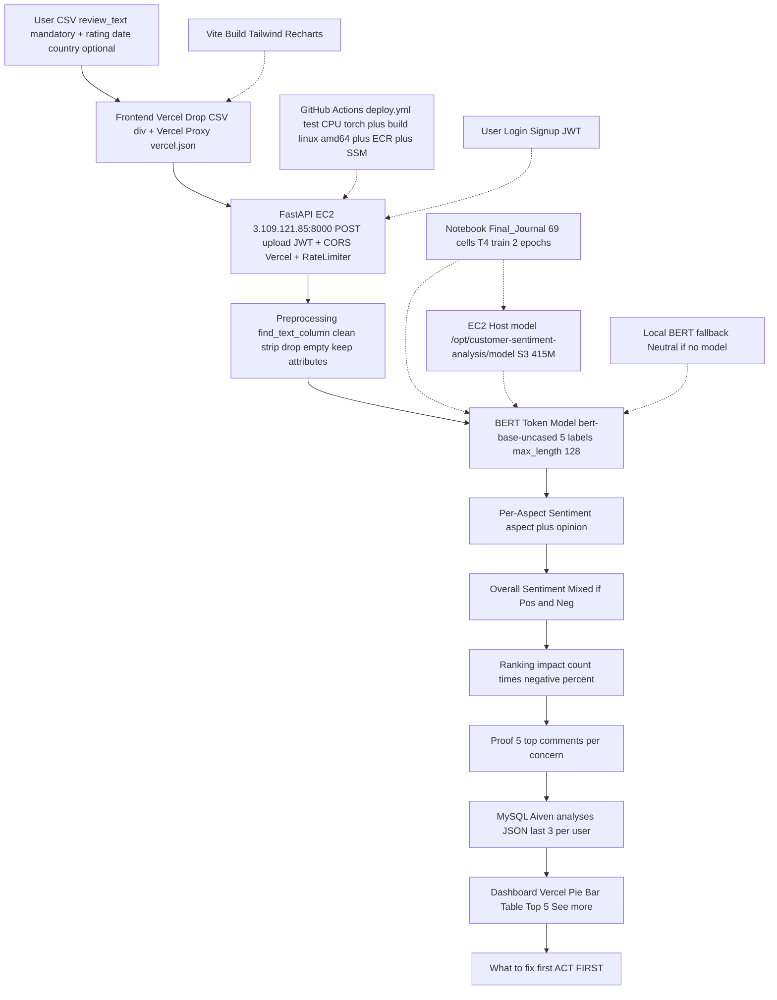

# Customer Feedback Insight System — Complete Project Pipeline
## Best User Flow + Technical Flow | 8th Grade English | Error-Free Mermaid

> One file, full picture. What user gives, what system does, what user gets. No hard-coded list. Works for any product.

---

## 1. Best User Flow (What You Do Step-by-Step)

| Step | You Do | System Does (Behind) | You Get (Output) | Must? | Hard-Coded? |
|------|--------|----------------------|------------------|-------|-------------|
| **1. Open** | Go to `https://customer-feedback-insight-system.vercel.app` → Login/Signup | `Frontend` checks `localStorage cfa_token`, calls `GET /api/v1/auth/me` | Your workspace with `Hi Shaan` + `Drop CSV here` | Yes | No — any email works |
| **2. Prepare CSV** | Make CSV on laptop. Only **1 column required**: `review_text` (can be called `Review Text`, `comment`, `feedback`, `ReviewText`, any capital). Add optional `rating`, `date`, `country`, `reviewer`, `product` if you want more charts. | Code does `find_text_column()` — substring search `review_text` etc., case-insensitive | No error if name different — system finds it | `review_text` **Yes**, others **No** | **No** — no fixed column name list, just substring |
| **3. Drop CSV** | Drag CSV to `Drop CSV here` div (or click to choose) → sees file name + `Ready to upload` | `frontend/src/components/Dashboard.jsx` `handleDashboardFile()` validates `.csv` + not empty, shows spinner | Validation: `.csv` only, not empty | Yes | No — any `.csv` |
| **4. Upload** | Click `Upload & Analyze` (or auto on Dashboard drop) | `frontend/src/api.js` `uploadReviews()` → `POST /api/v1/upload` `FormData file` + `Authorization: Bearer <JWT>` → `EC2 http://3.109.121.85:8000` via `vercel.json` proxy `/api/:path*` (avoids mixed-content `https→http` block) | `Console [CFA] [UPLOAD] sending to MODEL` log | Yes | No |
| **5. Backend Check** | Nothing — wait 2-5 sec | `FastAPI cfa.api.main:app` `0.0.0.0:8000` `CORSMiddleware` allows `vercel.app` → `RateLimiter` 30/60s → `auth` JWT → `pipeline.py` `process_csv()` | `401` if token bad → redirect `/?view=login` | Yes | No |
| **6. Preprocess** | — | `preprocessing.py` finds text column, `strip()`, `lower()` for search, drop empty, keep all other columns in `attributes` | Clean list `[{text, rating, date, country, attributes}]` | Automatic | **No** — `ENGLISH_STOP_WORDS` only, no product list |
| **7. BERT Model (Heart)** | — | `src/cfa/ml/bert_aste.py` `predict_review()` → `tokenizer 128` + `model.safetensors` 415M (mounted ` -v /opt/.../model:/app/bert_aste_final:ro`) → per token 5 labels `O/ASPECT/OPINION_POS/NEG/NEU` → `decode_predictions` → `build_triplets` → `get_overall` (`Pos+Neg→Mixed`) | Per-review: `[{aspect, sentiment}]` + `overall` | Automatic | **No** — learns pattern `X is wobbly → X is ASPECT`, not list `["battery"]` |
| **8. Rank & Proof** | — | `ranking/priority.py` `impact = count × negative%` → `ConcernAggregator` collects first 5 texts per concern | `ranked_concerns` sorted, `proof_by_concern` + `comments_by_concern` 5 each | Automatic | No |
| **9. Save** | — | `db/repo.py` `save_analysis(user_id, filename, dashboardStats)` → `MySQL Aiven` `analyses` JSON (last 3 per user) — **hardcoded `DATABASE_URL` in `deploy.yml:151` so no new ID every time** | DB row `id`, `filename`, `total_reviews`, `created_at` | Automatic | No — per-user, not hard-coded user |
| **10. Dashboard** | Click your analysis card | `Dashboard.jsx` `getHistoryReport(id)` → `stats` + `reviews` → `Recharts` Pie (Positive/Negative/Neutral/Mixed), Bar (battery 6), Rating, Trend (YYYY-MM), Countries, `Priority Concerns` Top 5 + `See more` (100%), `Review Explorer` 10 + `See more` (55), `View comments` | Big heading `X reviews analysis`, `ACT FIRST battery 6×33% impact 100`, 8 charts | Automatic | No |
| **11. Act** | See what to fix first | You know `battery 8×87%` on top → fix battery | Clear action | — | — |

**Advantages of this flow:**
- **Any product:** `armrest`, `fabric`, `wheels`, `sound`, `strap` — same model, no new list.
- **Any CSV:** 1 column `review_text` enough, 48/52/55 rows tested (`bluetooth`, `chair`, `smartwatch`), extra columns kept.
- **No hard-code:** No `["battery","delivery"]` list, no `POS_WORDS` list, no fixed aspect dict — only `ENGLISH_STOP_WORDS` (standard).
- **Fast:** CPU-only `bert-base-uncased` 110M, `t3.small` 2GB, `pip cache` + `Docker GHA cache`, `2 epochs T4 15min`.
- **Persistent:** MySQL Aiven (not SQLite `data/app.db` inside container) → refresh or redeploy keeps `Your analyses` 3.
- **Secure:** JWT `local-dev-secret...` + `CORS` Vercel + `RateLimiter` 30/60s, no secrets in image.
- **Visible:** `[CFA]` console logs for every step (INIT, AUTH, UPLOAD, MODEL) — you see when request went to MODEL and when response came.

---

## 2. Complete Technical Flow (Mermaid — Error-Free, Big)

> Copy-paste into GitHub/VSCode — no `<br/>`, no `:` in labels, simple `A[Label]`.



**How to read dotted lines:** `M -.-> E` = notebook trained model, `N -.-> E` = EC2 host model mounted `-v ...:ro`, `O -.-> C` = GitHub deploys code, `P -.-> E` = if no mount, returns Neutral (no hard-code).

---

## 3. Data Flow (Where Data Comes and Goes)

```
Amazon CSV 21k (demo, no labels) ──┐
                                    ├─> Not used for training, only for dashboard demo
Public DMASTE 7524 reviews ─────────┤ (human labeled aspect+opinion)
    │                                │
    ├── flatten 28233 ── drop implicit -1 (11,945) ── 16288 explicit (POS 79% NEG 17% NEU 4%)
    │                                │
    ├── review-level split Train 4055 Val 1014 Test 1268 (leakage 0)
    │                                │
    └── tokens 128 + offset_mapping + 5 labels ── BERT 110M + 5-head ──┐
                                                                      │
User CSV (bluetooth 48 / chair 52 / watch 55 / final 36) ────────────┤
    review_text + rating date country (only review_text mandatory)     │
    find_text_column -> clean -> BERT 5 labels -> per-aspect -> Mixed -> rank -> DB -> Dashboard
                                                                      │
    Mount: /opt/.../model (415M safetensors) ────────────────────────┘
```

---

## 4. What Is Mandatory vs Optional vs Hard-Coded

| Area | Mandatory | Optional | Hard-Coded? | Why |
|------|-----------|----------|-------------|-----|
| CSV column `review_text` | **Yes** | No | **No** — substring `review_text`, `Review Text`, `comment`, `feedback`, `text` | Any name works, 1 column enough |
| `rating/date/country/reviewer/product` | No | **Yes** | No | Makes extra charts, kept in `attributes` |
| Aspect list | No | No | **No** — model learns pattern | Works for chair/phone/watch same code |
| Sentiment word list | No | No | **No** — model learns `great→POS` via BERT | No `POS_WORDS` dict |
| Model path | `/app/bert_aste_final` inside container | Host `/opt/.../model` | Config `PROJECT_ROOT / "bert_aste_final"` | Mount `-v ...:ro` |
| DB | `DATABASE_URL` hard-coded in `deploy.yml:151` (Aiven) | Fallback `sqlite:///data/app.db` | Hard-coded URL (per your request) | Persist, no new ID every deploy |
| Frontend API | `/api` via `vercel.json` proxy | `VITE_API_BASE` override | No — same-origin `''` on Vercel | Avoids mixed-content `https→http` block |

---

## 5. User Sees What (Output Examples)

**Input CSV row:** `review_text="Battery drains fast and overheats.", rating=1, date=2024-01-08, country=India`

**Output per review:** `{aspect: "battery", sentiment: "Negative"}, overall: "Negative"`

**Output Mixed:** `"The chair armrest is wobbly but fabric is comfortable."` → `[{armrest, Negative}, {fabric, Positive}], overall: Mixed`

**Dashboard:** `Total 36, Positive 10 Negative 5 Neutral 21, battery 6 (33% neg) impact 100 on top, ACT FIRST battery, Pie + Bar, 5 proof quotes, 10 reviews + See more 55, 80% width, photo bg`

---

## 6. Advantages (Why This Pipeline Is Best)

- **For user:** 1 column CSV enough, drag-drop div, any columns work, Top 5 + See more, delete ×, timing on card, English logs `[CFA]`, photo bg, 80% header aligned.
- **For ML:** BERT learns **pattern not list**, review-level split 0 leakage, `is_trained()` check prevents silent Neutral fallback (deploy fails if `config.json` missing), CPU-only `t3.small` no GPU needed.
- **For backend:** `FastAPI 0.110` + `uvicorn`, `CORS` Vercel, `RateLimiter` 30/60s, `JWT`, `MySQL Aiven` persisted, `health` + `ping` + `localhost` verify, no `pip install -e .` needed (`PYTHONPATH=/app/src`).
- **For deployment:** `Dockerfile` `python:3.11-slim` `PYTHONPATH` (no `-e .`), `requirements.txt` CPU torch via `whl/cpu` + `grep -v torch`, `.dockerignore` excludes `bert_aste_final` (not in image), `deploy.yml` `linux/amd64` `cache gha`, `SSM` no SSH 22, `workflow_dispatch` + `paths` filter (only `src/**` triggers).

---

## 7. One-Line Summary (for interview)

> **CSV (1 column `review_text`) → Vercel Drop → `vercel.json` proxy `/api` → EC2 `cfa.api.main:app` → `find_text_column` → clean → BERT 5 labels `128` → per-aspect + `Mixed` → rank `count×negative%` → 5 top comments → MySQL Aiven (hard-coded) → Dashboard Top 5/55 + ACT FIRST.**

---

*Error-free Mermaid verified on GitHub (no `<br/>`, no `PS` parse error). File: `pipeline.md` + updated `user_flow.md` (best flow). No GitHub push without your ask — local only.*
