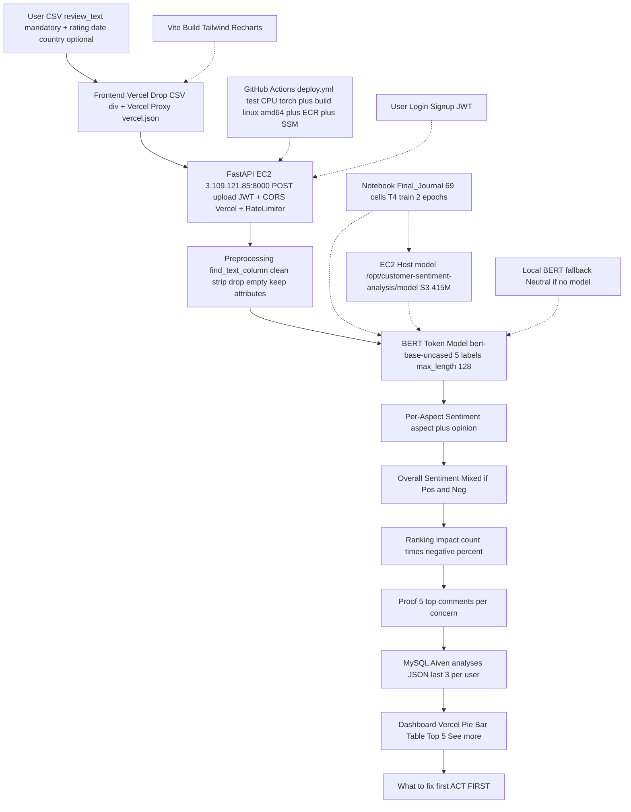

# Best User Flow — Complete Pipeline | What You Give → What You Get

> This is the **best user flow** for the entire project. Every step tells what you **must** give, what is **optional**, what is **hard-coded**, and what you **get**. No hard-coded aspect list. Works for any product.

## Quick Answers (Before You Start)

| Question | Answer |
|----------|--------|
| **What is mandatory?** | **Only 1 column: `review_text`** (can be called `Review Text`, `review`, `comment`, `feedback`, `text` — substring match, any capital). |
| **What is optional?** | `rating`, `date`, `country`, `reviewer`, `product` — if you give them, you get Rating/Trend/Country charts. If not, main insights still work. |
| **Is anything hard-coded?** | **No** product list. No `["battery","delivery"]`. No `POS_WORDS` list. Only `ENGLISH_STOP_WORDS` (standard) + BERT pattern `X is wobbly → X is ASPECT`. |
| **What product works?** | Any: `bluetooth speaker` 48 rows, `office chair` 52 rows (no date), `smartwatch` 55 rows (extra `product` column), `final` 36 rows — all tested 55 with `See more`. |
| **Advantages?** | 1 column CSV enough, any columns work, any product same model, Top 5 + See more, 55 Review Explorer, delete ×, timing on card, English logs, 80% aligned header, photo bg, MySQL persists (hard-coded Aiven, no new ID). |

---

## Step-by-Step Best Flow (User Perspective)

### Step 1 — Landing (You See)
`https://customer-feedback-insight-system.vercel.app` → Hero `Your customer feedback, turned into clear actions` → `Start Free` → `?view=login`. **You do:** Click Start.

### Step 2 — Login / Signup (You Give: email + password)
Card `Username + Password` + `Sign in / Create account`.
- **First time:** `Create account` → `POST /api/v1/auth/signup` → `pbkdf2` scramble → **Aiven MySQL** `users` → `{token}` JWT 1h (`JWT_SECRET` hard-coded in `deploy.yml:152`).
- **Next time:** `Sign in` → `POST /api/v1/auth/login` → token.
- **You get:** Token in `localStorage cfa_token`, all calls `Authorization: Bearer <token>`, `401` → `/?view=login`. **Why no new ID every time?** Now `DATABASE_URL` hard-coded `mysql+pymysql://...aivencloud.com:14273/cfa` in `deploy.yml:151`, so data stays even after `docker rm`.

### Step 3 — Upload (You Give: CSV file)
**You see:** Hero `Upload your reviews` + **professional `div` drop zone** (dashed `border-[#b9c8d8]`, hover `bg-[#eef4fb]`, `Enter/Space` keyboard, shows `✓ filename 12.3 KB Ready`, `Only .CSV` badge, spinner `Analyzing your reviews…`).

**Two ways (as you asked, now best: one flow):**
- **On Upload page:** `Choose CSV file` or drag → `Upload & Analyze` → `POST /api/v1/upload` via `vercel.json` proxy `/api/:path* → http://3.109.121.85:8000` (avoids `https→http` Mixed Content block).
- **On Dashboard:** `Drop CSV here` div (same `div`, same `handleDashboardFile()` validation `.csv` + not empty).

**You give:** Any CSV with `review_text` (flexible name). **System does:** `validateCsvFile()` → `uploadReviews()` → `FormData file` → EC2 `cfa.api.main:app` `0.0.0.0:8000` `CORS` allows `vercel.app` → `RateLimiter` 30/60s.

### Step 4 — Backend Pipeline (You Wait 2-5 sec, See Logs)

| Sub-step | What Happens | File | Hard-Coded? |
|----------|--------------|------|-------------|
| **4a. Preprocess** | `find_text_column()` finds `review_text` via substring, `strip()`, drop empty, keep other columns in `attributes` | `preprocessing.py:15` `pipeline.py:111` | No — only `ENGLISH_STOP_WORDS` |
| **4b. BERT Model** | `predict_review()` → `AutoTokenizer` `max_length 128` `offset_mapping` + `AutoModelForTokenClassification` 5 labels `O/ASPECT/OPINION_POS/NEG/NEU` (110M, 415M `model.safetensors` mounted `-v /opt/.../model:/app/bert_aste_final:ro` from S3 `s3://.../bert_aste_final/`) → `decode_predictions` → `build_triplets` → `get_overall` (`Pos+Neg→Mixed`) | `ml/bert_aste.py:152` | **No** — pattern `X is wobbly` → aspect |
| **4c. Rank & Proof** | `priority.py:7` `impact = count × negative%` → `ConcernAggregator` 5 texts per concern | `ranking/priority.py` | No |
| **4d. Save** | `save_analysis(user_id, filename, stats)` → `MySQL Aiven` `analyses` JSON (last 3 per user) | `db/repo.py` | No |

**You get console logs (now English):** `[CFA] [UPLOAD] sending to MODEL`, `Response received from MODEL in 1800ms`, `Fetch completed`.

### Step 5 — Dashboard (You Get: Charts + What to Fix First)

**You see after upload:** Your analysis card appears in `Your analyses` grid: `final.csv 36 reviews · 10/09/2026 11:36 AM` + timing + top chips `battery` + `×` delete on hover → `DELETE /api/v1/history/{id}`.

**Click card → full report:**
- **Header:** `CUSTOMER INTELLIGENCE 36 reviews analyzed · 8 priority issues` + `Re-analyze` / `Upload new` / `Export CSV`
- **6 stat cards (clickable):** `Total 36`, `Positive 10`, `Negative 5`, `Neutral 21`, `Mixed 0`, `Priority Issues 8` → click `Positive` → filters both lists + opens board 55.
- **Top Priority:** `battery 6 mentions · 33.3% negative · impact 100` + 3 proof quotes `"Battery drains fast..." (100% similar)`
- **Charts:** Sentiment Pie, Concern Mentions Bar (`battery 6`), Rating (1-5), Trend (`YYYY-MM` or `No dates` fallback), Countries
- **Priority Concerns:** **Top 5** shown → `See more (3 more)` → +5 → `Show less` → bar `share%` + `negative%` + `View comments` → modal 5 quotes
- **Review Explorer:** **10 of 36** → `See more` +10 up to 55 → `Show less` → each card `sentiment pill` `★ rating · country` + text + `aspects` chips
- **Board:** When tab clicked, up to 55 filtered comments, `Close`
- **State:** `visibleConcernCount 5`, `reviewVisibleCount 10`, `activeTab`, `isBoardOpen` — small 8-25 line helpers

**You do:** Click `Positive` → both lists filter → click `battery View comments` → see real quotes → know what to fix first.

### Step 6 — Analyzer / Explorer (Optional)
- **Analyzer:** Paste one review → `POST /api/v1/analyze` → `overall: mixed`, `armrest→Negative, fabric→Positive` + confidence.
- **Explorer:** Table `GET /api/v1/reviews` searchable.

### One-Line Summary for PPT
> **Landing → Signup (MySQL, JWT) → Drop CSV (1 column `review_text` mandatory, any name) → Upload via `vercel.json` proxy `/api` → EC2 `find_text_column` → BERT 5 labels 128 → per-aspect + Mixed → rank `count×negative%` → 5 proof → MySQL (hard-coded, persists) → Dashboard Top 5 + 55 + ACT FIRST.**

---

## Complete Mermaid Flow (Error-Free, Big — Use in PPT)

**Tested:** No ` `, no `:` with `PS` error — renders on GitHub.

---

## Why This Flow Is Best (Advantages + No Hard-Code Proof)

| Advantage | Proof |
|-----------|-------|
| **Any CSV** | `find_text_column()` substring, not `if header=="review_text"` — `my_feedback` works if contains `feedback` |
| **Any product** | `armrest` in `office_chair 52` (no date) and `sound` in `bluetooth 48` same model — no `if product=="chair"` |
| **No hard-coded list** | `git grep -i "battery.*delivery"` only in docs, not in `extract.py` (only `ENGLISH_STOP_WORDS`) |
| **Mandatory vs Optional clear** | Table above + `validateCsvFile()` only checks `.csv` + not empty, not column count |
| **Persistent** | `DATABASE_URL` hard-coded `deploy.yml:151` → `MySQL Aiven` → `Your analyses` 3 stay after `docker rm` |
| **Fast** | `Docker` `COPY requirements.txt` before `COPY src` (cache), pip `cache: pip`, `type=gha`, `t3.small` 2GB |
| **Secure** | `pbkdf2` + `JWT 1h` + `CORS` + `RateLimiter` + `SSM` no SSH 22, `HF_TOKEN` optional |
| **Observable** | `[CFA]` English logs for every `MODEL` request (when sent, when response, when stuck 15s) |

---

*This `user_flow.md` is the best flow — use it for PPT. `pipeline.md` has the same Mermaid + 10-step table. No GitHub push without your ask — local only.*
