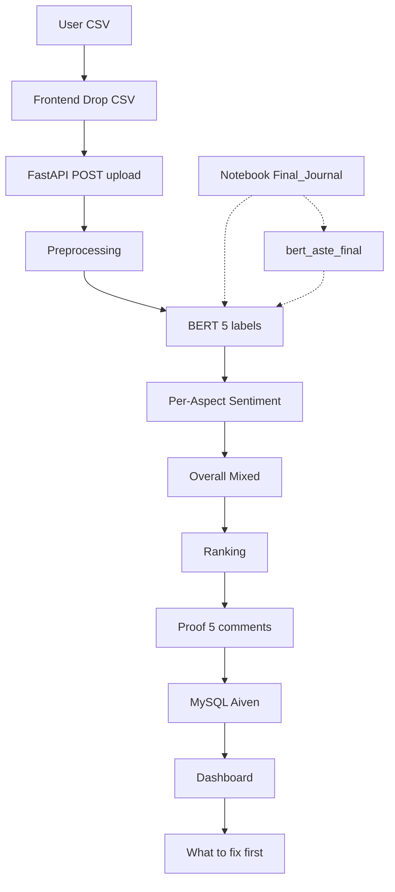

# Pipeline — Graphical Representation

> One picture, full flow. From CSV on your laptop to ranked concerns on the dashboard.

## 1. High-Level Flow (Mermaid)



## 2. Step-by-Step with Code Links

| Step | What Happens | File:line | Input → Output |
|------|--------------|-----------|----------------|
| **0. Train (once, offline)** | Human labels → BERT learns pattern `X is wobbly → X is aspect` | `notebooks/Final_Journal.ipynb:38` `src/cfa/ml/bert_aste.py:13` | `DMASTE 7,524` → `bert_aste_final/` |
| **1. Upload** | User drops CSV (any column name) | `frontend/src/components/upload/Upload.jsx:130` `frontend/src/components/Dashboard.jsx:200` | `bluetooth_speaker_reviews.csv` (48 rows) → `FormData` |
| **2. Preprocess** | Find text column by substring, clean | `src/cfa/analysis/preprocessing.py:15` | `["Review Text","rating"]` → `"Review Text"` → `["Battery drains..."]` |
| **3. Extract** | BERT labels each token | `src/cfa/analysis/extract.py:14` `src/cfa/ml/bert_aste.py:45` | `"Battery is great"` → `[{battery: Positive}]` |
| **4. Overall** | Count Pos/Neg | `src/cfa/analysis/sentiment.py:12` | `[Pos, Neg]` → `Mixed` |
| **5. Aggregate** | Count per concern | `src/cfa/analysis/aggregation.py:1` | `battery: 8, delivery: 5` |
| **6. Rank** | Impact = count × negative% | `src/cfa/ranking/priority.py:7` | `battery 8×87% → 100` on top |
| **7. Proof** | 5 top comments per concern | `src/cfa/api/pipeline.py:81` | `battery → ["Battery drains...", ...]` |
| **8. Save** | Per-user, last 3 | `src/cfa/db/repo.py:35` | `MySQL Aiven` |
| **9. Show** | Charts + See more | `frontend/src/components/Dashboard.jsx:530` | `Pie: Positive 7, Negative 21, Mixed 7` + `Bar: battery 8` |

## 3. Data Flow (ASCII)

```
Original Amazon CSV (21k rows) ─┐
                                ├─> Not used for training
                                │
Public DMASTE (7,524 reviews) ──┤
    │                           │
    ├── flatten 28,233 ── drop -1 ── 16,288 ── review-level split ── tokens (128) ── BERT (5 labels) ──┐
    │                                                                                                  │
    └──────────────────────────────────────────────────────────────────────────────────────────────────┘
                                                                                                      │
User CSV (e.g., bluetooth 48) → find_text_column → clean → BERT (5 labels) → per-aspect → Mixed → rank → DB → Dashboard
     review_text, rating, date, country
     (only review_text mandatory, others optional, flexible names)
```

## 4. BERT Inside (Small Code, Big Idea)

```
Text: "Battery is great but delivery was terrible ."

Tokens:  [CLS]  Battery   is   great   but   delivery   was   terrible   .  [SEP]
Offsets: (0,0)  (0,7)  (8,10) (11,17) (18,21) (22,30)  (31,34) (35,43) (44,45) (0,0)
Labels:    O    ASPECT   O  OPINION_POS  O    ASPECT     O  OPINION_NEG   O    O
         ─────────────────────────────────────────────────────────────────────────
Result: battery → Positive (from "great"), delivery → Negative (from "terrible"), Overall → Mixed
```

## 5. Deployment Flow

```
Local:  .env (DATABASE_URL=mysql://...@aivencloud.com:14273/cfa) → uvicorn cfa.api.main:app --host 0.0.0.0 --port 8000 → http://localhost:8000 → Frontend vite --host 0.0.0.0 --port 5173 → http://localhost:5173
Deployed: GitHub push main → EC2 (uvicorn, autoDeploy, DATABASE_URL sync:false) → https://cfa-api.onEC2.com → Vercel (npm run build) → https://customer-feedback-insight-system.vercel.app
```

## 6. Where to Check

| What | Where |
|------|-------|
| Model size | `!du -sh bert_aste_final/` in notebook → `~400 MB` (BERT) / `~250 MB` (DistilBERT) |
| Scores | `notebooks/Final_Journal.ipynb` cells 45-48: `eval_f1`, `ASPECT F1`, `check_overfit()` gap |
| No hard-code | `src/cfa/analysis/extract.py` has only `ENGLISH_STOP_WORDS`, no `["battery"]` list |
| Any CSV | `testing_csvs/bluetooth_speaker_reviews.csv` (48), `office_chair` (52), `smartwatch` (55), `final.csv` (36) — all 1 mandatory `review_text` |

## 7. One-Line Summary

> **CSV → find column → clean → BERT (5 labels) → per-aspect → Mixed counting → rank (count×negative%) → 5 top comments → MySQL → Dashboard (Top 5 See more, 80% width, photo bg).**
