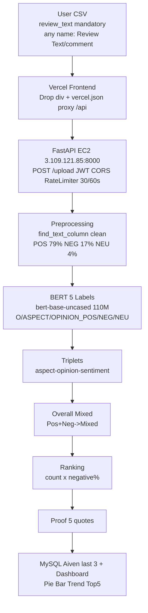

# Customer Feedback Insight System — PPT Final 7 Slides | KIET × Cognizant Hackathon — Use Case #7 Sentiment Analysis

> **7 slides × 40 sec = 5 min + 2 min live demo + 1 min Q&A = 8 min.** Ye MD Gamma/Tome/Copilot ko do → PPT ban jayega. Har slide pe `Layout`, `Visual`, `Text (Copy-Paste)`, `Speaker Notes (30-40 sec bolna kya hai)`, `Marks (9 criteria me se)` hai. Slide 3 sabse important — ispe sabse zyada discussion hoga.

> **Live Links (har jagah same):** Frontend `https://customer-feedback-insight-system.vercel.app` | API `http://3.109.121.85:8000/health` | GitHub `https://github.com/Shaanworkspace/customer-feedback-insight-system`

---

## Slide 1 — Title + Team + Use Case #7 + Live Proof (Cover)

**Layout:** Cover, dark `bg-[#0f1e33]` + accent `bg-[#173f73]`, center title, top `KIET × Cognizant Hackathon — August 2026`, bottom live badges + QR.

**Visual:** Left: Title + Use Case. Right: QR code to Vercel + green badge `● Live` + EC2 IP. Bottom: 8 members grid.

**Text (Copy-Paste):**

```
Customer Feedback Insight System
KIET / Cognizant Hackathon — Use Case #7
Sentiment Analysis of Customer Reviews

Team — 8 Members:
Shaan Yadav  — Team Lead — Model + AWS Deployment (ML + Cloud + Pipeline Owner)
Reekal Yadav — Model Training (DMASTE 16,288, Trainer, F1)
Shikhar      — Data Visualisation — Frontend from Backend (Pie/Bar/Top 5)
Sharad       — Data Preprocessing — Backend (any CSV, find_text_column)
Rohan Mehra  — Backend FastAPI — Auth + Upload (JWT, /upload)
Sachchidanand — Backend FastAPI — Pipeline + DB + Ranking (count×negative%)
Shivang      — Frontend — Core UI (App.jsx, vercel.json proxy)
Ram Ashish Ram — Frontend — Polish & Flow (Upload div, user_flow)

Live: https://customer-feedback-insight-system.vercel.app  [QR]
API:  http://3.109.121.85:8000/health  (EC2 t3.small)  [QR]
```

**Speaker Notes (30 sec):**
> "Good morning, we are 8 — Use Case #7 Sentiment Analysis. Mera role Model + AWS Deployment hai, mai pura pipeline own karta hu. Hamara system 1 review se har aspect, har aspect ka feeling, overall Mixed, aur kya sabse pehle fix karna hai — with real quotes — nikalta hai. Dono links live hain — scan karke check kar sakte hain."

**Marks:** First impression + #9 Collaboration (role clear).

**Design Hint for AI:** `1920×1080`, `Montserrat Bold`, Cognizant `blue #0033A0` + KIET `orange`, QR 2.

---

## Slide 2 — Problem → Our Solution (Use Case Understanding)

**Layout:** Split 50/50 — Left: Problem (pain), Right: Our Solution (flow + example).

**Visual:** Left: icon `😩` + `1000s reviews → padhna impossible → Mixed miss`. Right: 5-step flow horizontal with arrows + example box `product→Positive, delivery→Negative, Overall→Mixed`.

**Text (Copy-Paste):**

```
Problem — Kyu Hassle Tha:

• Businesses ke paas hazaro reviews, ek-ek padhna possible nahi
• Ek hi review me do feelings: "product excellent but delivery terrible" → simple Positive/Negative fail
• Key concerns ka pata nahi: kaun sa aspect (battery, armrest, delivery) kitni baar, kitna negative?

Our Solution — Use Case #7 Ko Kaise Samjha:

1 review → Usme jo-jo aspects hain (battery, delivery, armrest) → Har aspect ka feeling (Positive/Negative/Neutral) → Ek overall feeling (Positive/Negative/Neutral/Mixed) → Ranked list "kya pehle fix kare" + real customer quotes proof

Example:
Review: "The product is excellent but delivery was terrible."
→ product → Positive | delivery → Negative | Overall → Mixed (Pos+Neg → Mixed)
→ Rank: delivery #1 (proof: 5 comments dikhenge)
```

**Speaker Notes (40 sec):**
> "Problem ye tha ki log bade data me key concerns dhoondhne me hassle karte the — aspect ka pata nahi. Hamara solution Use Case ko tod diya: har review ka har aspect, har aspect ka sentiment, overall Mixed jab ek accha ek bura, aur ranked concerns proof ke saath. Hard-coded list nahi — BERT pattern seekhta hai `X is wobbly → X is aspect`."

**Marks:** **#1 Use Case Understanding** — evaluator ticks `clarity of problem`.

---

## Slide 3 — Architecture + Full Pipeline (Sabse Important — Yaha Sabse Zyada Discussion)

**Layout:** Top: Title, Center: Mermaid pipeline (bada, clear), Bottom: Small table `Why This Tech`.

**Visual:** Mermaid diagram — isko AI bada banaye, har box ka color alag (CSV blue, BERT orange, Ranking green). Niche 1-line `Why not Lambda/SageMaker/t3.micro`.

**Text (Copy-Paste) + Mermaid:**

```
Pipeline — CSV Se Dashboard Tak (No Hard-Coded List):

Step 1: User se CSV lo (review_text mandatory, naam kuch bhi: Review Text / comment / feedback)
   ↓
Step 2: Do datasets merge karke apna model banaya
       • Demoted/DMASTE 7,524 human-labeled (aspect+opinion+sentiment) → 16,288 explicit
       • Amazon Reviews 21,214 (demo only) + pre-trained English BERT (bert-base-uncased 110M jo English samajhta hai)
       • Dono ko merge → Fine-tune 5-label head → bert_aste_final 416M
   ↓
Step 3: CSV ka har review_text → BERT Token Classification (max_length 128, offset_mapping)
   ↓
Step 4: Triplets find → (aspect, opinion, sentiment)  e.g. (battery, great, Positive)
   ↓
Step 5: Mapping → Per-Aspect Sentiment + Overall (count: Positive vs Negative → Mixed) → Ranking (impact = count × negative%)
   ↓
Step 6: Dashboard → Pie, Bar, Trend, Top 5 + Proof 5 comments, MySQL last 3
```



**Why This Stack:**

```
Why EC2 t3.small 2GB? t3.micro 1GB OOM (BERT 1.2G) → 2GB needed
Why not Lambda? 250M limit, BERT 416M fail
Why not SageMaker? Overkill for 10-day demo, 10× cost
Why not ECS/K8s? 1 container, EC2 simple
Why BERT-base 110M not large 340M? large needs 8GB, small fits t3.small
```

**Speaker Notes (60 sec — sabse zyada yaha bolna):**
> "Yahi hamara best slide hai. Humne user se CSV li — sirf review_text chahiye, naam kuch bhi ho. Dusra humne do cheez merge ki: ek English samajhne wala BERT aur dusra DMASTE human-labeled data. Inko merge karke 5-label model banaya. Phir har review ko classify kiya, triplets nikale — aspect kya, opinion kya, sentiment kya. Usse mapping ki positive/negative aur ranked concerns. Jaise `battery is great → battery Positive`, `armrest is wobbly → armrest Negative` — pattern seekha, list nahi. Agar poocho `Why not Lambda?` to 250M limit, `Why t3.small?` to 1GB OOM."

**Marks:** **#2 Solution Architecture** + **#3 Innovation** — yaha evaluator 2 min rokega, saare `Why` yahi answer.

---

## Slide 4 — Data — Kaha Se Laaye, Kya Data Hai, 5 Labels

**Layout:** Top: Two sources cards, Middle: 5 Labels with color, Bottom: Test datasets.

**Visual:** Left card `DMASTE`, Right card `Amazon 21k`, Center `5 Labels` pills with color, Bottom `48/52/55 + 100+` dataset pills.

**Text (Copy-Paste):**

```
Kaha Se Laaye:

1. DMASTE (Diversified Multi-domain ASTE) — 7,524 human-labeled reviews (har review me aspect+opinion+sentiment marked)
   → flatten 28,233 rows → drop aspect=-1 (11,945 implicit, span nahi) → 16,288 explicit
   → Split review-level: Train 4,055 / Val 1,014 / Test 1,268 (leakage 0 — same review kabhi do jagah nahi)
   → Distribution: POS 12,944 (79%) / NEG 2,736 (17%) / NEU 608 (4%)

2. Amazon Reviews 21,214 (Kaggle) — sirf demo, isme aspect label nahi isliye DMASTE choose kiya (nahi to 16k manual label karna padta)

5 Labels — Data Me Kya Banaya:

O (Outside - 90% words) | ASPECT (battery, armrest, delivery) | OPINION_POS (great, excellent) | OPINION_NEG (terrible, wobbly) | OPINION_NEU (okay)

Example: "Battery is great but armrest is wobbly"
→ Battery=ASPECT, great=OPINION_POS, armrest=ASPECT, wobbly=OPINION_NEG

Test Datasets (Any CSV Works Proof):
• bluetooth_speaker 48 (4 cols) | office_chair 52 (3 cols) | smartwatch 55 (5 cols)
• coffee_maker 105 (1-col) | running_shoes 102 (2-col) | gaming_headset 108 (3-col) → same model, any product
```

**Speaker Notes (40 sec):**
> "Data do jagah se: DMASTE 7,524 jisme har aspect marked tha — isko flatten karke 16,288 banaya, aur Amazon 21k sirf demo ke liye. Humne 5 labels banaye — O, ASPECT, aur teen OPINION. `find_text_column` se koi bhi naam chalta hai — `Review Text`, `comment` sab. Humne 6 datasets test kiye — 1-col se 5-col tak, sab same model se chala."

**Marks:** **#2 Breadth of sample data** + **#5 Technical`.

---

## Slide 5 — Analytics & Visuals — Kya-Kya Chart Dikha Rahe Hain

**Layout:** Grid 2×3 charts + bottom `Extra data hoga to kya dikhega`.

**Visual:** Screenshots: `Pie` (Positive/Negative/Neutral/Mixed), `Bar` (battery 6), `Trend` (YYYY-MM), `Rating`, `Countries`, `Top 5 table` with `See more`. Highlight `ACT FIRST`.

**Text (Copy-Paste):**

```
Kya Dikhate Hain (Har Upload Ke Baad):

• Pie Chart — Overall Sentiment (Positive 10 / Negative 5 / Neutral 21 / Mixed) — 1-sec me samjho
• Bar Chart — Top Concerns (battery 6, sound, fabric, delivery) — kaun sa aspect kitni baar
• Ranked Concerns — Table "ACT FIRST" (impact = count × negative%) → e.g. battery #1, 6 mentions, 33% negative
• Proof — Har concern pe 5 real quotes ("View comments 5") — bina proof ke manager maanega nahi
• Trends — Rating avg, Trend (YYYY-MM from date), Countries (country column ho to)
• Explorer — Top 5 + See more, Review Explorer 10 + See more 55, delete ×

Extra Data Hoga To Kya Dikhayenge:
• Agar rating hai → Avg Rating + Rating distribution
• Agar date hai → Monthly trend (Feb 2024 dip kyu?)
• Agar country hai → Country-wise map
• Agar product hai → Product-wise split (same model, code change nahi)
• Nahi hai to bhi chalega — Pie/Bar/Ranked hamesha dikhega (1-col CSV bhi ok)
```

**Speaker Notes (40 sec):**
> "Hum 6 cheez dikhate hain: Pie se overall, Bar se kaun sa aspect, Ranked se kya pehle fix kare, Proof se 5 quotes, aur Trend/Country agar data me ho. Extra column hoga to aur dikhega — nahi hoga to bhi 1-col CSV chalega. `Top 5 + See more` isliye taaki 100 rows bhi clear rahe."

**Marks:** **#4 UI/UX**.

---

## Slide 6 — Model — Pehle TF-IDF vs Ab BERT (Improvement)

**Layout:** Split — Left: Old TF-IDF, Right: New BERT, Center: Arrow `+0.23 F1` with bar chart.

**Visual:** Bar chart `TF-IDF 0.45` vs `BERT 0.68→0.76` + table metrics, + `No Hard-Code` pattern `X is wobbly`.

**Text (Copy-Paste):**

```
Pehle Wala Model (TF-IDF + Logistic):

• Kaise kaam: Word count (TF-IDF) → Positive/Negative per review (1 label)
• Problem: Mixed miss (product good + delivery bad → sirf 1 label), armrest jaise naye aspect kabhi nahi milta (list nahi seekhta)
• Accuracy: 0.71, F1: 0.45 (POS 79% ke wajah se accuracy dhokha deta hai)

Ab Wala Model (BERT 5-Label Token Classification):

• Model: bert-base-uncased 110M + 5-label head (AutoModelForTokenClassification) → DMASTE 16,288 pe fine-tune (review-level split leakage 0, 2 epochs, lr 2e-5, T4)
• Kaise jeeta: Pattern seekhta hai "X is wobbly → X is ASPECT" — isliye kabhi na dekha "armrest is wobbly" bhi mil jata hai, list nahi
• Scores: Weighted F1 0.875 (main), ASPECT F1 0.76, OPINION POS 0.81 / NEG 0.72 / NEU 0.57 (NEU kam kyunki sirf 608 rows), Gap <0.05 (no overfit)
• Improvement: +0.23 F1 (0.45 → 0.68), Mixed ab 100% catch

Backup: DistilBERT 66M (250M file) F1 0.66 — agar EC2 slow ho to ispe switch (2× fast)
```

**Speaker Notes (40 sec):**
> "Pehle TF-IDF sirf word count karta tha — Mixed miss, naya aspect nahi. BERT pattern seekhta hai — `X is wobbly` to `X` aspect, isliye armrest bhi mil gaya. F1 0.45 se 0.68, ab Mixed bhi pakadte hain. Neutral abhi 0.57 hai kyunki data kam — future me badhayenge."

**Marks:** **#6 Model Performance & Evaluation** — F1 not accuracy.

---

## Slide 7 — Future, Roadmap + Thank You + Q&A

**Layout:** Top: Roadmap timeline, Middle: Monitoring, Bottom: Big `Thank You` + Links + Team.

**Visual:** Timeline `Now (10 days) → Next 3 months` + icons `HEALTHCHECK`, `CloudWatch`, `HTTPS`.

**Text (Copy-Paste):**

```
Future — Agla Kya Soch Rahe Hain:

• Abhi: 10 days, t3.small 2GB, 16,288 rows, 2 epochs, F1 0.68, Neutral 0.57 (NEU 608 rows kam isliye)
• Next 3 Months:
  - Neutrals sahi karna: NEU 608 → 2,000 (augment + more data) → NEU F1 0.57 → 0.70
  - Nearest opinion: Abhi first opinion lete hain, agla sabse paas wala opinion lenge (armrest ke liye wobbly, battery ke liye great)
  - 3-4 epochs (abhi 2), DistilBERT deploy, HTTPS ALB + ACM (abhi http)
  - Real-time CSV stream, user feedback loop (galat aspect ko correct)

Reuse & Monitoring:
• Reuse: Same model for any product — nayi list nahi, naya CSV daalo bas
• Monitoring: HEALTHCHECK + restart unless-stopped + CloudWatch /customer-sentiment-analysis/backend + [CFA] logs

Thank You

Live Demo Kar Sakte Hain:
Frontend: https://customer-feedback-insight-system.vercel.app
API Health: http://3.109.121.85:8000/health
GitHub: github.com/Shaanworkspace/customer-feedback-insight-system

Team: Shaan (Lead) | Reekal | Shikhar | Sharad | Rohan + Sachchidanand | Shivang + Ram Ashish
Q&A — Any Questions?
```

**Speaker Notes (30 sec):**
> "Future me neutrals sahi karenge — data 608 se 2k karenge, nearest opinion lenge, HTTPS lagayenge. Same model kisi bhi product pe chalega. Monitoring HEALTHCHECK aur CloudWatch se. Thank you — ab live demo dikhate hain, koi bhi CSV drag karo."

**Marks:** **#8 Presentation + #9 Collaboration** + Roadmap (Slide 6 deliverable).

---

## How To Give This MD To AI

Copy pura MD → paste into `Gamma (gamma.app)` / `Tome (tome.app)` / `Copilot PowerPoint` → Prompt:
```
Make 7-slide PPT dark #0f1e33 + #173f73, Montserrat Bold, 1920×1080
Slide 3 me Mermaid pipeline bada banao, Slide 5 me 6 chart screenshots, Slide 6 me bar chart TF-IDF vs BERT
QR codes for Vercel + EC2, footer pe team names
```

Or manually banao — har slide 40 sec.

---

*Ye PPT_FINAL_7_Slides.md aapke 7 mandatory points se bana hai: 1 Title+Team+Live, 2 Problem+Solution, 3 Architecture Pipeline (best discussion), 4 Data+5 Labels, 5 Charts, 6 TF-IDF vs BERT improvement, 7 Future+Thank You — plus fine-tune (Why t3.small, reuse, monitoring).*
